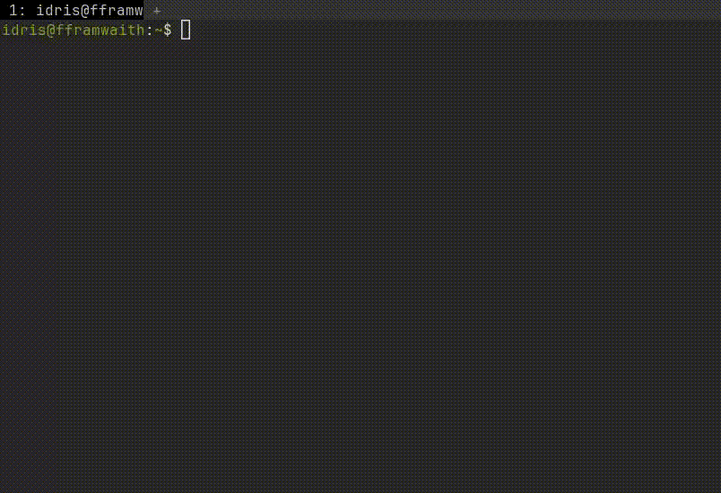

# :card_file_box: distrobox.wezterm

Enter a distrobox container in a new Wezterm tab with just a few keystrokes.

---

#### :wave: Introduction



I like the functionality of [ptyxis](https://gitlab.gnome.org/chergert/ptyxis) but I'm not a fan of GTK terminals. 
I use distrobox containers quite a lot and wanted to switch between them easily.
This lead to distrobox.wezterm, a simple tool that opens a list of available distrobox containers with a customisable keybinding that can be entered in a new wezterm tab.

---

1. [Installation](#installation)
2. [Configuration](#configuration)
    1. [Keybindings](#keybindings)
    2. [Entry Commands](#entry-commands)
3. [Hints and Tips](#hints-and-tips)
    1. [Default Entry Command](#default-entry-command)
    2. [Fuzzy Find Containers](#fuzzy-find-containers)

---

#### :computer: Installation <a name="installation"></a>

```lua
local distrobox = wezterm.plugin.require("https://github.com/CaderIdris/distrobox.wezterm")
distrobox.apply_to_config(config) -- Base config if you don't want to modify the defaults
```

**Dependencies**
- distrobox needs to be installed on the system.
- This plugin has been designed to work with wezterm both as a flatpak and unsandboxed.
    - It is untested on non-standard linux distributions.
- The host shell needs the `awk` and `tail` commands to function, most shells should have these.

---

#### :screwdriver: Configuration <a name="configuration"></a>

**Keybindings** <a name="keybindings"></a>
If you want to change the default keybindings, you can add your custom options when calling `apply_to_config`.

```lua
local distrobox = wezterm.plugin.require("https://github.com/CaderIdris/distrobox.wezterm")
custom_config = {
    key='mapped:r', 
    -- mapped: is a wezterm keybinding specific prefix that is dependent on the keyboard layout.
    -- The default is phys: which triggers whenever the key *would* have been pressed if the user was using a US ANSI kayboard
    mod='CTRL|ALT|SHIFT'
}
distrobox.apply_to_config(config, custom_config)
```

**Entry Commands** <a name="entry-commands"></a>
Distrobox has the option to execute a command when entering a container.
For example, you may want to enter a different shell to the default (e.g zsh) or immediately enter tmux.
You can set the entry commands by adding another entry to the `custom_config`.
```lua
local distrobox = wezterm.plugin.require("https://github.com/CaderIdris/distrobox.wezterm")
custom_config = {
    entry_commands = {
        archlinux="zsh",
        ["container-name-with-special-characters"]="nu",
        alpine="tmux",
        ubuntu="fish"
    }
}
distrobox.apply_to_config(config, custom_config)
```

---

#### :bulb: Hints and Tips <a name="hints-and-tips"></a>

**Default Entry Command** <a name="default-entry-command"></a>
Have a lot of containers and want a default entry command for them?
Steal this example that always defaults to zsh.
```lua
-- Taken from https://www.lua.org/pil/13.4.3.html
function set_default(t, d)
        local mt = {__index = function () return d end}
        setmetatable(t, mt)
end

local distrobox_enter_commands = {}

set_default(distrobox_enter_commands, "zsh")

distrobox.apply_to_config(config, {entry_commands=distrobox_enter_commands})
```
**Fuzzy Find Containers** <a name="fuzzy-find"></a>
As this plugin uses wezterm's inbuilt InputSelector, if you have a lot of containers and want to fuzzy search, press `/` with the menu open and it will switch to fuzzy mode.

###### :worried: Tech Debt

- Only a single entry command is allowed so ones with arguments (e.g tmux -L container-name) won't work. This could be fixed by splitting the provided command by spaces into a table of strings and appending them all iteratively. Out of scope until someone complains.
- This is the first lua project that isn't me messing round with wezterm or neovim on my own system and so there are innumerable unforseen issues.
- This plugin uses `io.popen`. If the lua interpreter is sandboxed further, this may no longer work. Unlikely but a possibility.
